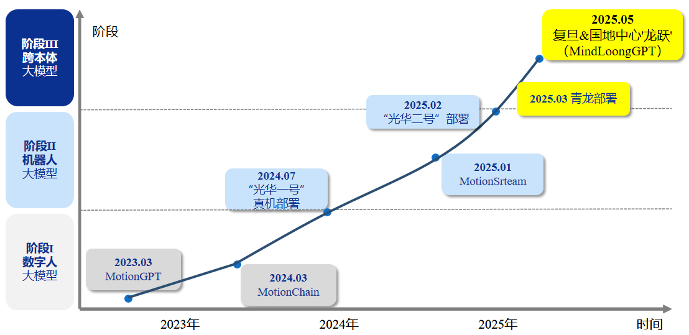
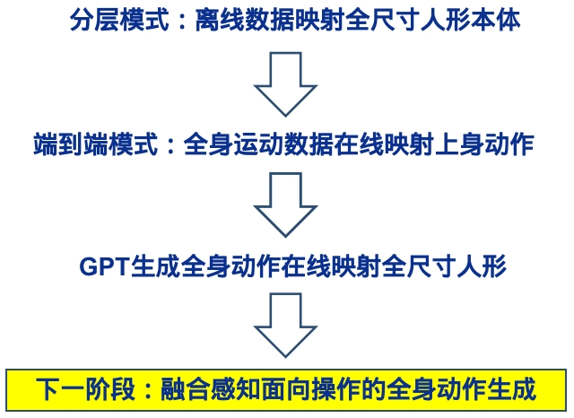

# 🐉 龙跃 MindLoongGPT

<div style="display: flex; gap: 16px; align-items: center;">


</div>

## 📌 项目概述

龙跃 MindLoongGPT 大模型，以“自然语言驱动”为核心，构建了从多模态输入到动作生成的完整闭环。

## 🎥 演示视频

| 仿真效果                        |
|:------------------------------:|
|  |
|**实机运行** | 
|  |
## ✨ 核心优势

### 1. 🎨 多模态交互

- 支持文本/语音/视频输入
- 自然语言指令直接生成动作
- 零参数配置，开箱即用

### 2. ⏱️ 拟真运动

- 时序语言建模技术
- 长序列动作生成
- 保持真实运动惯性

### 3. 🧩 精细控制

- 全局到局部的分层优化
- 精准的关节控制
- 媲美真人的细节表现

### 4. 🚀 轻量高效

- 体积仅为同类 1/3
- 嵌入式设备实时运行
- 支持多平台部署

## 📅 里程碑

<div align="center">
  
</div>

- **2025/05/29** - 国地中心与复旦大学联合发布全球首款生成式人形机器人运动大模型"龙跃"(MindLoongGPT)

<div align="center">
  
</div>

## 🚀 快速开始

### 1. 🛠️ 环境配置

- MotionGPT 环境

```bash
git clone https://github.com/OpenMotionLab/MotionGPT
```

**需要手动将script/loong_fit.py 拷贝到 motiongpt文件夹**

环境安装请参考MotionGPT

- MindLoongGPT 环境

```bash
# 创建并激活虚拟环境
conda create -n retarget python=3.8 -y
conda activate retarget

# 下载isaacgym放到项目根目录下
cd MindLoongGPT
pip install -e isaacgym/python
pip install -e .
```

- SMPL模型配置

1. 从[官网](https://smpl.is.tue.mpg.de/index.html)下载模型放到`script/retarget/smpl/model/smpl`文件夹下
2. 将模型下载并改名：
```
  |-- smpl
      |-- SMPL_python_v.1.1.0.zip
```
```
  |-- smpl
      |-- SMPL_python_v.1.1.0
        |-- models
            |-- basicmodel_f_lbs_10_207_0_v1.1.0.pkl
            |-- basicmodel_m_lbs_10_207_0_v1.1.0.pkl
            |-- basicmodel_neutral_lbs_10_207_0_v1.1.0.pkl
        |-- smpl_webuser
        |-- ...
```
```
  |-- smpl
      |-- SMPL_FEMALE.pkl
      |-- SMPL_MALE.pkl
      |-- SMPL_NEUTRAL.pkl
```

#### 🔍 配置说明：

- 两个环境需独立配置

- 中间需要切换numpy（1.23 或 2.3）版本

- SMPL模型需手动下载并重命名

- 确保文件路径正确

- 项目中只有demo数据，完整数据集在huggingface上，包括AMASS数据集和自采集数据：
  - [AMASS数据集：](https://huggingface.co/datasets/OpenLoong/Public_Retargeted)
      <div align="center">
        
      </div>
  - [自采集数据集：](https://huggingface.co/datasets/OpenLoong/mocap_dataes)
      <div align="center">
        
      </div>

### 2. 📚 基本使用指南

- 生成 npz 动作集阶段

```bash
# 进入MotionGPT目录
cd motiongpt

# 基础动作生成
python demo.py

# 带配置的动作生成（推荐）
python demo.py \
  --cfg ./configs/config_h3d_stage3.yaml \
  --example ./demos/t2m.txt
```

输入是 txt 文档，输出是 xx_out.npy（frame,22,3）

- 转换成spml格式阶段

```bash
cd motiongpt
python loong_fit.py \
  --dir /path/to/input_npy_files \  # 上一步输出文件目录
  --save_folder /path/to/output_smpl \  # 输出目录
  --cuda
```

输入是 xx_out.npy（frame,22,3），输出是类似amass数据集的npz文件

- 重定向到青龙机器人阶段

```bash
cd MindLoongGPT
python script/retarget/smpl/grad_fit_openloong.py
```

输入是npz文件，输出是重定向后的pkl文件


### 3. 📂 核心脚本说明
- 重定向脚本在`script/retarget/smpl`以及`script/retarget/mink`文件夹下：


1. `grad_fit_openloong_shape.py`用于对青龙机器人进行 SMPL 体型参数 β 的匹配。如果没有青龙体型参数文件或者更改了体型匹配权重，那么在进行重定向任务前，应**首先执行一次**该程序。
2. `grad_fit_openloong.py`用于重定向，将之前生成的 npz 放入 Amass 文件夹下运行
3. `loong_retarget_bvh.py`用于动捕设备导出的 BVH 文件重定向。

- 可视化脚本在`script/vis`文件夹下：

1. `vis_MotionGPT.py`用于可视化 MotionGPT 生成的原始动作。
2. `vis_SMPLVertices.py`用于可视化 SMPL 匹配效果和动画。
3. `vis_RetargetedResult.py`用于可视化重定向结果中各关节数据。
4. `vis_mujoco.py`用于在 mujoco 仿真 csv 的运动数据。
5. `vis_isaacgym.py`用于在 isaac gym 仿真 csv 的运动数据。
6. `vis_motion_openloong.py`用于在 isaac gym 仿真 SMPL 的 pkl 的运动数据。

## 📚 文献引用

##### 若应用本开源项目中的代码，请以以下格式进行引用：

```JavaScript
@software{Robot2025OpenLoong,
  author = {Humanoid Robot (Shanghai) Co., Ltd},
  title = {{openloongretarget}},
  url = {https://gitee.com/panda_23/openloongretarget},
  year = {2025}
}

@article{jiang2024motiongpt,
  title={Motiongpt: Human motion as a foreign language},
  author={Jiang, Biao and Chen, Xin and Liu, Wen and Yu, Jingyi and Yu, Gang and Chen, Tao},
  journal={Advances in Neural Information Processing Systems},
  volume={36},
  year={2024}
}

@inproceedings{chen2023executing,
  title={Executing your Commands via Motion Diffusion in Latent Space},
  author={Chen, Xin and Jiang, Biao and Liu, Wen and Huang, Zilong and Fu, Bin and Chen, Tao and Yu, Gang},
  booktitle={Proceedings of the IEEE/CVF Conference on Computer Vision and Pattern Recognition},
  pages={18000--18010},
  year={2023}
}

@software{Zakka_Mink_Python_inverse_2025,
  author = {Zakka, Kevin},
  title = {{Mink: Python inverse kinematics based on MuJoCo}},
  year = {2025},
  month = may,
  version = {0.0.11},
  url = {https://github.com/kevinzakka/mink},
  license = {Apache-2.0}
}

@inproceedings{SMPL-X:2019,
    title = {Expressive Body Capture: 3D Hands, Face, and Body from a Single Image},
    author = {Pavlakos, Georgios and Choutas, Vasileios and Ghorbani, Nima and Bolkart, Timo and Osman, Ahmed A. A. and Tzionas, Dimitrios and Black, Michael J.},
    booktitle = {Proceedings IEEE Conf. on Computer Vision and Pattern Recognition (CVPR)},
    year = {2019}
}

@article{MANO:SIGGRAPHASIA:2017,
    title = {Embodied Hands: Modeling and Capturing Hands and Bodies Together},
    author = {Romero, Javier and Tzionas, Dimitrios and Black, Michael J.},
    journal = {ACM Transactions on Graphics, (Proc. SIGGRAPH Asia)},
    volume = {36},
    number = {6},
    series = {245:1--245:17},
    month = nov,
    year = {2017},
    month_numeric = {11}
  }

@article{SMPL:2015,
    author = {Loper, Matthew and Mahmood, Naureen and Romero, Javier and Pons-Moll, Gerard and Black, Michael J.},
    title = {{SMPL}: A Skinned Multi-Person Linear Model},
    journal = {ACM Transactions on Graphics, (Proc. SIGGRAPH Asia)},
    month = oct,
    number = {6},
    pages = {248:1--248:16},
    publisher = {ACM},
    volume = {34},
    year = {2015}
}

@inproceedings{Luo2023PerpetualHC,
    author={Zhengyi Luo and Jinkun Cao and Alexander W. Winkler and Kris Kitani and Weipeng Xu},
    title={Perpetual Humanoid Control for Real-time Simulated Avatars},
    booktitle={International Conference on Computer Vision (ICCV)},
    year={2023}
}

@inproceedings{rempeluo2023tracepace,
    author={Rempe, Davis and Luo, Zhengyi and Peng, Xue Bin and Yuan, Ye and Kitani, Kris and Kreis, Karsten and Fidler, Sanja and Litany, Or},
    title={Trace and Pace: Controllable Pedestrian Animation via Guided Trajectory Diffusion},
    booktitle={Conference on Computer Vision and Pattern Recognition (CVPR)},
    year={2023}
}

@inproceedings{Luo2022EmbodiedSH,
  title={Embodied Scene-aware Human Pose Estimation},
  author={Zhengyi Luo and Shun Iwase and Ye Yuan and Kris Kitani},
  booktitle={Advances in Neural Information Processing Systems},
  year={2022}
}

@inproceedings{Luo2021DynamicsRegulatedKP,
  title={Dynamics-Regulated Kinematic Policy for Egocentric Pose Estimation},
  author={Zhengyi Luo and Ryo Hachiuma and Ye Yuan and Kris Kitani},
  booktitle={Advances in Neural Information Processing Systems},
  year={2021}
}
```

## 🤝 参与贡献

代码仓库: [MindLoongGPT](https://github.com/loongOpen/MindLoongGPT)

问题反馈: [Issues](https://github.com/loongOpen/MindLoongGPT/issues)

联系我们: open@openloong.org.cn

<div align="center"> <sub>© 2025 人形机器人（上海）有限公司 | <a href="https://www.openloong.net">官网</a></sub> </div>
